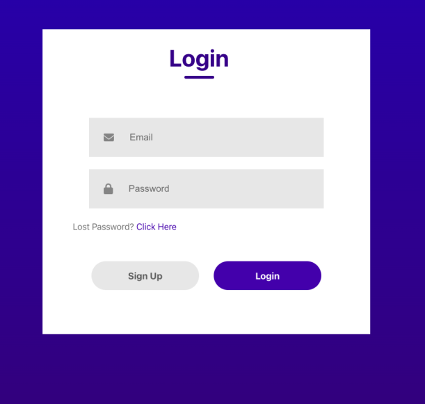

# Basic Sign-up / Login page

This project was built using React and plain css.

## Sign up page:

## Login page:

## Running the project

- Clone the project into a directory in your PC.
- Run npm i to install the dependencies.
- When the installation is done, open the project by running npm run start
